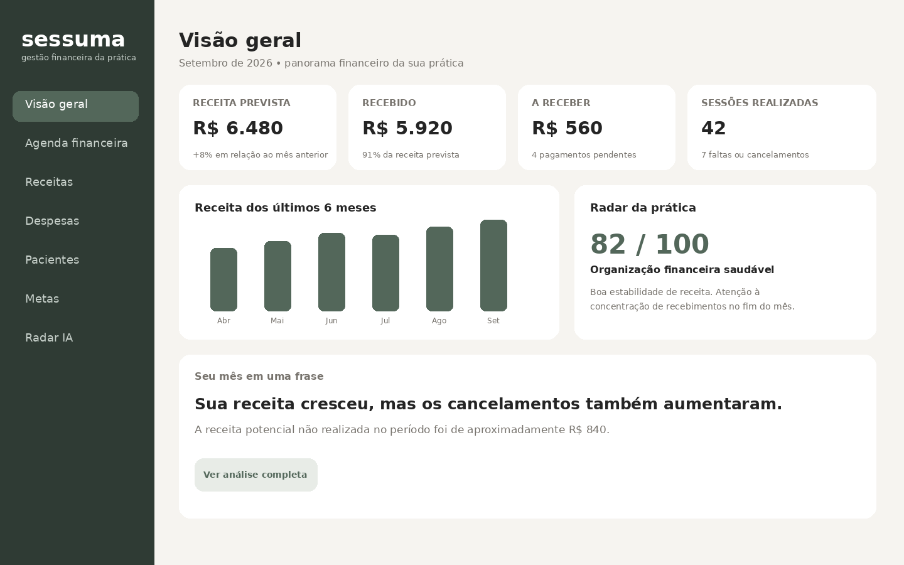
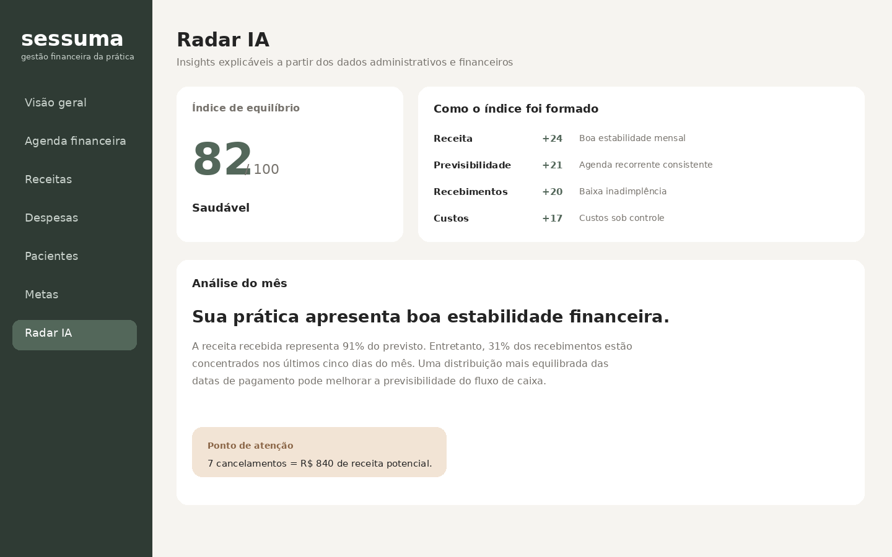
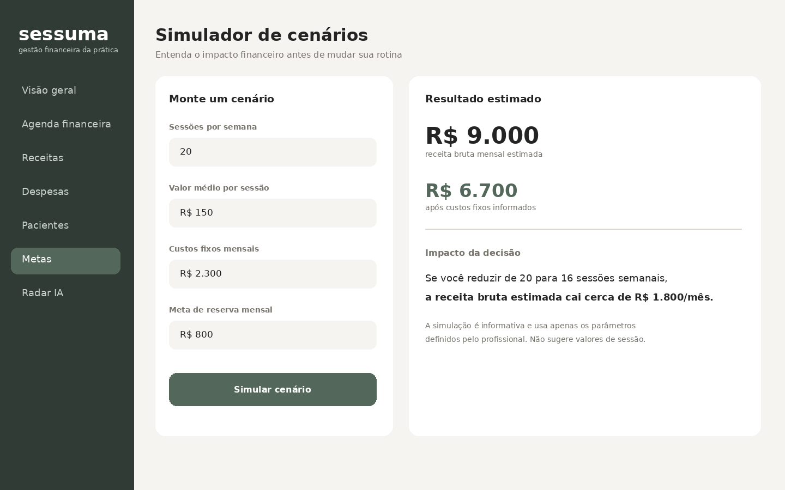

# Sessuma

> **Inteligência financeira para uma prática clínica mais sustentável.**



## Sobre o projeto

O **Sessuma** é um conceito de aplicativo de organização financeira pensado para psicólogos(as) que atuam de forma autônoma. A proposta nasceu da percepção de que organizar uma prática clínica envolve muito mais do que registrar entradas e saídas: é preciso acompanhar sessões, recebimentos, cancelamentos, custos, metas e entender se a rotina profissional é financeiramente sustentável.

O nome **Sessuma** combina as ideias de **sessão + soma**, representando a transformação dos dados administrativos da prática em uma visão financeira simples e útil.

O aplicativo não tem como objetivo substituir prontuários, sistemas clínicos ou oferecer recomendações sobre quanto o profissional deve cobrar. Seu foco é a **gestão administrativa e financeira**, mantendo dados clínicos sensíveis fora do escopo do MVP.

## Problema

Profissionais autônomos da Psicologia podem ter dificuldade para visualizar com clareza:

- quanto da receita prevista já foi recebida;
- quanto ainda está pendente;
- o impacto financeiro de faltas e cancelamentos;
- quais são os custos reais da prática;
- qual é a previsibilidade financeira dos próximos meses;
- como mudanças na agenda ou no valor das sessões impactam o planejamento;
- quanto da receita é efetivamente convertida em resultado após os custos da atividade.

O Sessuma busca transformar essas informações em indicadores e explicações simples.

## Público-alvo

Psicólogos(as) autônomos(as), especialmente profissionais que administram a própria agenda, recebimentos e despesas da prática clínica e ainda utilizam planilhas, anotações ou ferramentas separadas para realizar esse controle.

## Proposta de valor

**Transformar agenda, sessões, recebimentos e custos em inteligência financeira para apoiar decisões sobre a sustentabilidade da prática profissional.**

A principal diferença do Sessuma é não utilizar IA apenas como chatbot. A inteligência artificial atua na interpretação dos dados financeiros, na identificação de padrões e na construção de cenários, sempre apresentando ao usuário os dados que sustentam cada insight.

## Funcionalidades do MVP

### Visão Geral

Dashboard com os principais indicadores do mês:

- receita prevista;
- receita recebida;
- valores pendentes;
- despesas;
- sessões realizadas;
- faltas e cancelamentos;
- receita potencial não realizada;
- evolução mensal da receita.

### Agenda Financeira

Cada atendimento possui somente os dados administrativos necessários à gestão financeira:

- identificador do paciente;
- data da sessão;
- valor;
- status do atendimento;
- status do pagamento;
- recorrência.

Não são armazenados diagnóstico, evolução, conteúdo da sessão ou informações de prontuário.

### Receitas e Despesas

Controle das movimentações da prática profissional, com categorias como:

- atendimentos;
- supervisão;
- aluguel de consultório;
- plataformas digitais;
- formação profissional;
- materiais;
- tributos;
- outras despesas.

### Radar da Prática

A IA transforma os dados registrados em uma leitura objetiva da situação financeira.

Exemplo:

> Sua receita cresceu 8% em relação ao mês anterior. Apesar do crescimento, o número de cancelamentos também aumentou e representa aproximadamente R$ 840 em receita potencial não realizada.

O Radar apresenta também um **Índice de Equilíbrio Financeiro**, calculado a partir de dimensões como receita, previsibilidade, recebimentos e custos.



### Simulador de Cenários

Permite testar decisões antes de alterar a rotina profissional.

Exemplos:

- “Qual seria o impacto se eu reduzisse minha agenda de 20 para 16 sessões por semana?”
- “Como ficaria minha projeção mensal alterando o valor médio da sessão?”
- “Quanto preciso faturar para manter uma reserva mensal de R$ 800?”
- “Qual o impacto dos meus custos fixos no resultado mensal?”

O sistema apresenta projeções com base exclusivamente nos parâmetros informados pelo usuário, sem definir quanto um profissional deve cobrar.



## Uso de Inteligência Artificial

A IA do Sessuma foi pensada para quatro funções principais:

1. **Interpretar:** traduzir indicadores financeiros em linguagem simples.
2. **Comparar:** identificar mudanças relevantes entre períodos.
3. **Projetar:** estimar cenários futuros a partir dos dados informados.
4. **Explicar:** mostrar quais informações levaram a determinado insight.

A IA não realiza diagnóstico psicológico, não interpreta conteúdo clínico e não fornece recomendações de investimento.

## Prompt final / PRD

```text
Crie o conceito de um aplicativo web responsivo chamado Sessuma, voltado à organização
financeira de psicólogos autônomos.

OBJETIVO
Transformar dados administrativos da prática profissional, como sessões, recebimentos,
cancelamentos e despesas, em uma visão clara da sustentabilidade financeira da prática.

PÚBLICO-ALVO
Psicólogos autônomos que administram a própria agenda e finanças e desejam substituir
controles fragmentados por uma visão simples, visual e inteligente.

PRINCÍPIO DO PRODUTO
O aplicativo é financeiro e administrativo. Não deve armazenar conteúdo de sessões,
diagnósticos, evolução clínica, anamnese ou prontuários.

TELAS PRINCIPAIS

1. VISÃO GERAL
Criar dashboard mensal com:
- receita prevista;
- receita recebida;
- valores pendentes;
- total de despesas;
- sessões realizadas;
- faltas/cancelamentos;
- receita potencial não realizada;
- gráfico de evolução da receita;
- resumo inteligente do mês.

2. AGENDA FINANCEIRA
Exibir atendimentos por data contendo somente:
- identificador do paciente;
- data e horário;
- valor;
- status do atendimento;
- status do pagamento;
- recorrência.

3. RECEITAS E DESPESAS
Permitir registrar movimentações e classificá-las por categoria.

4. RADAR DA PRÁTICA
Criar um Índice de Equilíbrio Financeiro de 0 a 100.
O índice deve ser explicável e dividido em dimensões:
- receita;
- previsibilidade;
- recebimentos;
- custos.
Sempre mostrar quais dados contribuíram para a pontuação.

5. SIMULADOR DE CENÁRIOS
Permitir que o usuário altere parâmetros como:
- quantidade de sessões semanais;
- valor médio da sessão;
- custos fixos;
- meta de reserva.
Mostrar o impacto estimado da alteração na receita e no resultado mensal.

6. METAS
Permitir criar metas financeiras da prática e acompanhar o progresso mensal.

INTELIGÊNCIA ARTIFICIAL
A IA deve:
- resumir o desempenho financeiro do mês;
- comparar períodos;
- identificar variações relevantes;
- explicar indicadores;
- gerar projeções a partir dos parâmetros informados;
- evitar linguagem prescritiva.

A IA não deve:
- analisar conteúdo clínico;
- realizar diagnóstico;
- sugerir conduta terapêutica;
- recomendar investimentos;
- determinar quanto o psicólogo deve cobrar.

EXPERIÊNCIA
A interface deve transmitir organização, calma e profissionalismo.
Utilizar visual minimalista, fundo claro, cards com cantos arredondados, tipografia limpa
e tons de verde acinzentado e neutros. Evitar estética hospitalar ou excessivamente
corporativa.

O dashboard deve ser a tela principal e priorizar leitura rápida.
Todos os insights de IA devem ser explicáveis e relacionados a indicadores visíveis.

PRIVACIDADE
Aplicar minimização de dados. O MVP deve trabalhar somente com dados administrativos
necessários à finalidade financeira. Não incluir prontuário psicológico.
```

## Exemplo de interação durante o processo de Vibe Coding

### Prompt de refinamento

```text
O dashboard está apresentando números, mas quero que ele ajude o profissional a compreender
o que mudou no mês. Crie uma seção chamada "Seu mês em uma frase" que compare receita,
recebimentos e cancelamentos com o período anterior. Evite julgamentos e recomendações
prescritivas. O texto deve explicar os dados de maneira objetiva.
```

### Prompt de refinamento do simulador

```text
No simulador, não diga ao psicólogo quanto ele deveria cobrar. O usuário deve informar o
valor da sessão e a IA deve apenas calcular o impacto financeiro de diferentes cenários.
Inclua uma explicação mostrando quais parâmetros foram usados no cálculo.
```

### Prompt de privacidade

```text
Revise o produto seguindo o princípio de minimização de dados. Remova qualquer campo de
diagnóstico, evolução, conteúdo da sessão ou prontuário. Para a gestão financeira, utilize
somente um identificador do paciente e dados administrativos necessários ao controle dos
atendimentos e pagamentos.
```

## Decisões de design

A identidade visual foi construída para se afastar tanto da aparência de aplicativos bancários quanto da estética de sistemas hospitalares. A proposta utiliza tons neutros e verde acinzentado, bastante espaço em branco, cards simples e informações apresentadas em níveis de prioridade.

O foco da experiência é fazer com que o usuário consiga responder rapidamente três perguntas:

**Como está minha prática hoje?**

**O que mudou?**

**Qual pode ser o impacto da minha próxima decisão?**

## Diferenciais

O projeto se diferencia de um controle financeiro convencional por conectar as movimentações à dinâmica de uma prática profissional baseada em sessões. A IA não é tratada como uma funcionalidade isolada: ela participa da interpretação dos indicadores e das simulações.

Outro diferencial é a separação intencional entre **gestão financeira** e **informação clínica**, reduzindo a coleta de dados que não são necessários ao propósito do aplicativo.

## Tecnologias sugeridas para uma implementação futura

Para um MVP funcional, a solução poderia ser implementada com React ou Next.js no front-end, Supabase para autenticação e persistência dos dados, biblioteca de gráficos para os indicadores e uma API de modelo de linguagem para os recursos de interpretação e simulação assistidos por IA.

> Nesta entrega, o foco está na concepção do produto, experiência, regras de negócio e uso de IA por meio de Vibe Coding.

## Aprendizados

O desenvolvimento do Sessuma mostrou que Vibe Coding não significa apenas pedir para uma IA criar uma aplicação. A qualidade do resultado depende principalmente da capacidade de transformar uma ideia em requisitos claros, revisar o que foi produzido e refinar os prompts conforme novas necessidades aparecem.

Durante o processo, percebi também a importância de delimitar o papel da IA. Como o projeto envolve Psicologia, inicialmente seria fácil transformar a solução em um sistema clínico completo. Ao restringir o escopo à organização financeira e evitar dados de prontuário, o produto ficou mais coerente com o problema que pretende resolver.

Outro aprendizado foi pensar a IA como parte da experiência e não apenas como um chatbot. No Sessuma, ela tem uma função específica: ajudar a interpretar números, comparar períodos e simular cenários, mantendo o usuário no controle das decisões.

Por fim, o desafio reforçou que um bom prompt funciona como uma especificação de produto. Quanto mais claros estão o problema, o público, as regras e os limites da solução, mais consistente tende a ser o resultado gerado.

## Próximos passos

Em uma evolução do projeto, poderiam ser explorados recursos como integração com calendário, importação de movimentações, geração de relatórios, projeções anuais e automações de cobrança, sempre mantendo a separação entre os dados financeiros e os registros clínicos.

---

### Projeto desenvolvido para o desafio de Vibe Coding da DIO

Conceito, requisitos, prototipação e documentação desenvolvidos com apoio de Inteligência Artificial.
